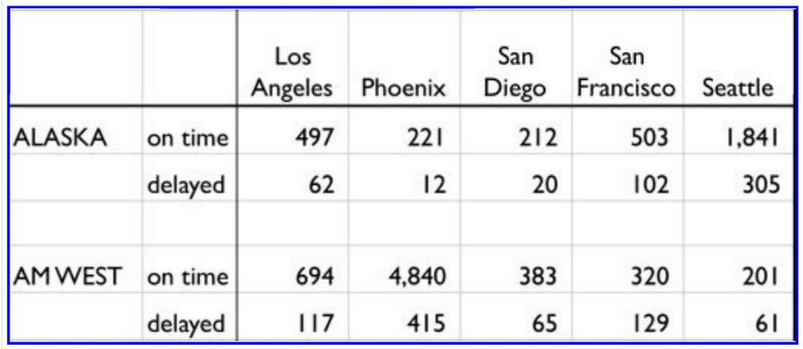

```{r setup, include=FALSE}
knitr::opts_chunk$set(echo = TRUE)
library(dplyr)
library(tidyr)
library(DT)
```

### Assignment




The chart above describes arrival delays for two airlines across five destinations. Your task is to:

1. Create a .CSV file (or optionally, a MySQL database!) that includes all of the information above. You’re encouraged to use a “wide” structure similar to how the information appears above, so that you can practice tidying and transformations as described below.
2. Read the information from your .CSV file into R, and use tidyr and dplyr as needed to tidy and transform your data.
3. Perform analysis to compare the arrival delays for the two airlines.

### Read data from CSV file

```{r}
flights <- read.csv("FlightData.csv", header = T)
dim(flights)
head(flights)
```

### Get rid of blank row

```{r}
flights <- flights[c(1,2,4,5), ]
flights
```

### Fix column 1 so that there is data in every row

```{r}
flights[c(2,4),1] <- flights[c(1,3),1]
flights
```

### Fix first two column names

```{r}
colnames(flights)[1:2] <- c('airline', 'status')
flights
```

### Use tidyr to move header to column

```{r}
tidyflights <- gather(flights, key = 'destination', value = 'n', 3:7)
tidyflights
```

### Use tidyr to spread data into two columns for Status

```{r}
tidyflights <- spread(tidyflights, status, n)
tidyflights
```


### Use dplyr to add columns for total, percent on time, and percent delayed

```{r}
tidyflights <- tidyflights %>% 
  mutate(total = delayed + `on time`,
         percent_on_time = round(`on time`/total*100, 2),
         percent_delayed = round(delayed/total*100, 2))
datatable(tidyflights)
```

### Use dplyr summarize function to compare airlines

```{r}
compareAll <- tidyflights %>% 
  group_by(airline) %>%
  summarize(OnTime = sum(`on time`), Delayed = sum(delayed), 
            PercentOnTime = round(OnTime/sum(OnTime,Delayed),2))%>%
  select(airline, PercentOnTime)
compareAll %>% arrange(desc(PercentOnTime))
```

This is not what I expected because Alaska airlines has 4 out of the top five spots for percentage of on time flights!  AM West has a better overall average because they have a very large number of flights to Phoenix with a high on time percentage to that destination.

### Use dplyr to filter out Phoenix to see the comparison accross the other destinations

```{r}
minusPhoenix <- tidyflights %>%
  filter(!destination %in% c('Phoenix')) %>%
  group_by(airline) %>%
  summarize(OnTime = sum(`on time`), Delayed = sum(delayed), 
            PercentOnTime = round(OnTime/sum(OnTime,Delayed),2)) %>%
  select(airline, PercentOnTime)
minusPhoenix %>% arrange(desc(PercentOnTime))
```

When you filter out Phoenix you can see that now Alaska Airlines has a better average on time percentage.

So if you are flying to Phoenix take AM West!  But if you are flying to any of the other destinations you have a better chance of being on time with Alaska airlines.

```{r}
Alaska <- tidyflights %>% filter(airline %in% c('ALASKA')) %>% 
  select(airline, destination, percent_on_time)
Alaska %>% arrange(desc(percent_on_time))

AMWest <- tidyflights %>% filter(airline %in% c('AM WEST')) %>% 
  select(airline, destination, percent_on_time)
AMWest %>% arrange(desc(percent_on_time))
```


