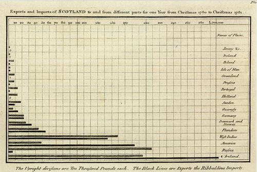
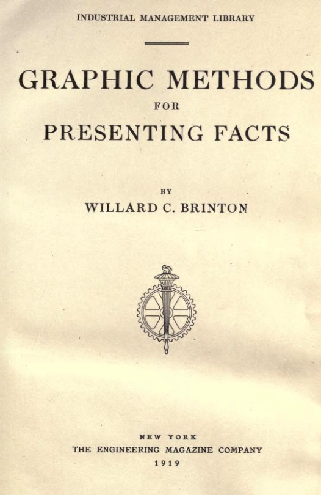
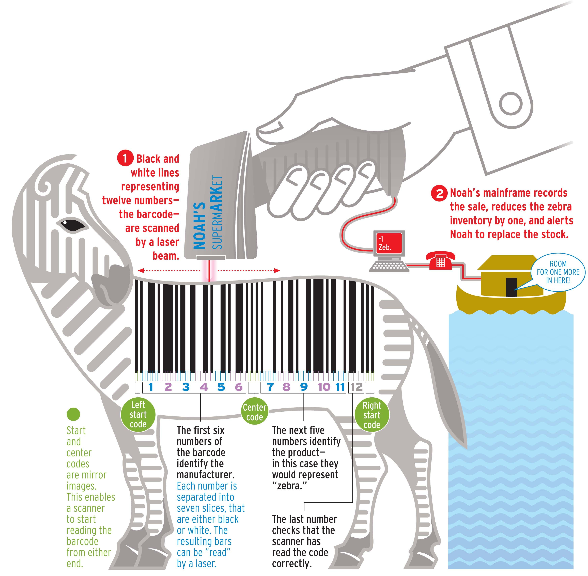

```{r global_options, echo=FALSE}
knitr::opts_chunk$set(echo=FALSE, warning=FALSE, message=FALSE)
```

# What this presentation is about

- What is data visualization?
- History of data visualization
- Why do we need it?
- What makes a good visualization?

<br>

Main Source: [Good Charts: The HBR Guide to Making Smarter, More Persuasive Data Visualizations by Scott Berinato ](https://www.amazon.com/gp/product/1633690709/ref=oh_aui_detailpage_o02_s00?ie=UTF8&psc=1)

# What this presentation is NOT about

- ggplot2
- coding
- how-to
- rules for creating good visualizations

# What is data visualization?

## Anything that visually communicates information

<table align="center">
<tr>
<td>
### Charts

</td>
<td>
### Graphs

</td>
<td>
### Maps

</td>
<td>
### Diagrams

</td>
</tr>
</table>

# What is data visualization?

## Including...

<table align="center">
<tr>
<td>
### Emojis!!!

</td>
</tr>
</td>
</tr>
</table>

# History of data visualization

## First data visualizations?

Lascaux Cave Paintings, France - Estimated to be up to 20,000 years old
    
<table>
<tr>
<td>

</td>
<td>

</td>
<td>

</td>
</tr>
</table>

Nazca Lines, Peru - Created between 500 BC and 500 AD

<table>
<tr>
<td>

</td>
<td>

</td>
<td>

</td>
</tr>
</table>

# History of data visualization

## Dataviz as we know it

### William Playfair (1759-1823) engineer and political economist

Credited with inventing line graphs, bar charts, pie charts, and circle graphs 

Line graphs and bar charts first published in 1786 in ***The Commercial and Political Atlas***, pie charts came later

<table>
<tr>
<td width=50%>

</td>
<td width=50%>

</td>
</tr>
</table>

# History of data visualization

## Important early work

### Florence Nightengale (1820-1910) founder of modern nursing, statistician, dataviz pioneer

1858 - "coxcomb diagrams" showed that infection and disease killed more soldiers than any other cause

Resulted in improved hospital sanitation

<table>
<tr>
<td>

</td>
</tr>
</table>

# History of data visualization

## First infographic

### Charles Minard (1820-1910) 

1869 - visualization of Napoleon’s disastrous invasion of Russia showing the decimation of Napoleon's army

Brown bar steadily diminishes in size as it approaches "Moscou"

<table>
<tr>
<td>

</td>
</tr>
</table>

# History of data visualization

## First book about dataviz for business

### Willard Brinton (1880–1957)

***Graphic Methods for Presenting Facts*** published in 1914

Describes rules for presenting data including which charts to use and which charts to avoid

Recommends some chart types that are still popular today: small multiples, bump charts and slope graphs

Possibly the first to question the efficacy of pie charts

<table>
<tr>
<td>

</td>
</tr>
</table>

# History of data visualization

## First theory of visualization

### Jacques Bertin (1918–2010)

***Semiologie graphique*** published in 1967 

Describes seven "visual variables" for "encoding" data: position, size, shape, color, brightness, orientation, and texture

Two core principles:

- **principle of expressiveness** - show what you need to; no more, no less
- **principle of effectiveness** - use the most efficient method available to visualize your information

#### These principles still influence data visualization today!

# History of data visualization

## Computer visualizations

### John Tukey and Jock Mackinlay

1970's and 1980's first Tukey then Mackinlay help bring data visualization into the digital age.  

Tukey popularizes the terms exploratory and confirmatory visualization

Mackinlay creates software to automate data visualization and adds "motion" to Bertin's 7 visual variables

# History of data visualization

## Modern Dataviz

### Edward Tufte (1942-) [Pronounced TUFF-tee](https://www.edwardtufte.com/bboard/q-and-a-fetch-msg?msg_id=00005F)

***The Visual Display of Quantitative Information*** published in 1983 

Minimalist approach to data visualization design

Coined the term "chartjunk"

Quotes:

- "Graphical excellence is that which gives to the viewer the greatest number of ideas in the shortest time with the least ink in the smallest space." - *The Visual Display of Quantitative Information*
- "Above all else show the data." - *The Visual Display of Quantitative Information*
- "Clutter and confusion are failures of design, not attributes of information." 
- "Today's graphics use multiple shapes and colors to cover up a paucity of data."
- "There is no such thing as information overload. There is only bad design."

# History of data visualization

## Visual perception research

### William S. Cleveland and Robert McGill

Cleveland and McGill's research into how we read graphics informed ***The Grammar of Graphics*** by Leland Wilkinson

which in turn informed the development of ggplot2

Tried to quantify graphic perception, but relied on mostly static black and white graphics


# History of data visualization

## The "anti-Tufte"

### Nigel Holmes (1942-) created graphics for mass media at Time Magazine

*Pretty* infographics - Uses attractiveness and aesthetics to catch the eye, evoke an emotional response, and communicate to a mainstream audience

<table>
<tr>
<td width=50%>

</td>
<td width=50%>

</td>
</tr>
</table>

# History of data visualization

## Designers vs. Computer scientists

### Early research by Cleveland and McGill makes two (possibly erroneous) assumptions:

- you already have the audience's attention
- efficiency and effectiveness of displaying the data are the primary goals.

Modern research is finding that some of the old rules and maxims don't hold up in the modern technological world

### Even pie charts are OK sometimes!


# Why do we need data visualization?

## Helps us quickly understand huge amounts of data at a glance

### Impact of polio vaccine


# Why do we need data visualization?

## Helps identify correlations, trends, and patterns that might otherwise go unnoticed

### Anscombe's quartet


# Why do we need data visualization?

## Helps draw attention to the main message

### Can you tell what the first picture is about?

<table>
<tr>
<td width=40%>

</td>
<td width=60%>

</td>
</tr>
</table>

# Why do we need data visualization?

## It's a requirement for effective communication in the digital age

### Modern businesses demand it


# What makes a good visualization?

## The one that best communicates your message *to your intended audience*

### Know your audience


# What makes a good visualization?

## Humanize your data


# What makes a good visualization?

## Don't flaunt conventions without reason...


# What makes a good visualization?

## Don't flaunt conventions without reason...

<table>
<tr>
<td>

</td>
<td>
Expected conventions

- Like colors mean like items
- Color saturation indicates a progression of values
- Categories are arranged and plotted from one extreme to the another
</td>
</tr>
</table>

# What makes a good visualization?

## Rules are meant to be broken

### Kown the "rules" but also know when and why to break them

All the Government Barbecues won a [Kantar Information is Beautiful Award](https://www.informationisbeautifulawards.com/showcase/2508)!


Sources: [dataviztoday.com](https://dataviztoday.com/shownotes/)

[all-the-government-barbecues](https://vsueiro.github.io/data-stories/all-the-government-barbecues/en/)

# What makes a good visualization?

## Think visually


# What makes a good visualization?

## No cookie cutters or recipes to follow


