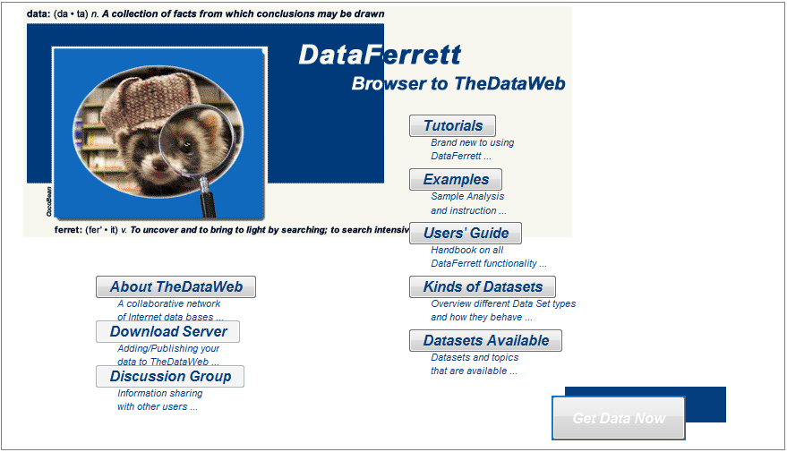

```{r setup, include=FALSE}
knitr::opts_chunk$set(echo = TRUE, message=FALSE, warning=FALSE)
```

## Project Description

I recently attended a faculty day talk by Dr. Tanzina Ahmed on food security concerns facing the students at CUNY Bronx Community College (BCC) where she shared the work that she is doing with her research partner Dr. Rositsa Ilieva of The New School. I would like to do my own analysis of her dataset and a comparison of the food security issues at BCC vs. other demographic groups or national averages.  I hope this analysis will help me and my coleagues gain a better understanding of the unique challenges that the students at Bronx Community College face.  

## Data Collection

### Bronx Community College Data

I contacted Dr. Ahmed and she generously agreed to share a portion of her data with me to use in my project.  It was emailed to me in the form of a SPSS (.sav) file that represents the first 100 cases in her dataset.  She requested that I cite her work as the source of the data and not share the data.  See the [Citations] at the end of the report.

If you would like to reproduce my analysis please contact me so I can get permission to share access to the data provided by Drs. Ahmed and Ilieva.  

```{r}
# Use the haven package to load the SPSS .sav file
library(haven)
bcc_data <- read_spss(file.path("~","GitHub","DATA_607_Data_Acquisition_and_Management","Final_Project","FoodAccessStudy_Variables_100participants.sav"))
```

### Census Data

#### First Attempt - Direct Download of Full Dataset

The Census data was much more difficult to obtain.  I first tried downloading the full Current Population Survey Food Security Supplement (CPS) dataset from here: <https://thedataweb.rm.census.gov/ftp/cps_ftp.html#cpssupps> but the format of the data made it very difficult to work with.  There was no header row and every method I tried using to import the data did not result in a useful dataframe.  

```{r eval=FALSE, include=FALSE}
# Can't get read.delim to work.  Tried different encodings and delimiters.  It loads as 150,000+ records of one variable.  
# There's no header to tell what the data means either although that can be handled with the documentation
census_data <- read.delim("/Users/Betsy/OneDrive/CUNY SPS MDS/DATA 607 - Aquisition and Management/Final Project/dec16pub.dat", sep = "\t", encoding = "ASCII")
```

```{r eval=FALSE, include=FALSE}
# Can't get read_tsv to work either... 
library(readr)
census_data <- read_tsv("/Users/Betsy/OneDrive/CUNY SPS MDS/DATA 607 - Aquisition and Management/Final Project/dec16pub.dat", col_names=FALSE)
```

```{r eval=FALSE, include=FALSE}
# Can't get fread to work either... 
library(data.table)
census_data <- fread("/Users/Betsy/OneDrive/CUNY SPS MDS/DATA 607 - Aquisition and Management/Final Project/dec16pub.dat", sep=" ")
```

```{r eval=FALSE, include=FALSE}
# Tried saving as a csv file and then using edit replace to replace all spaces with commas, but that didn't work either... 
# It imported nicely, but unfortunately the data didn't line up correctly and data points wound up in wrong columns
census_data <- read.csv("/Users/Betsy/OneDrive/CUNY SPS MDS/DATA 607 - Aquisition and Management/Final Project/dec16pubcopy.csv", header=FALSE)
```

#### Second Attempt - Census APIs 

Since the direct download didn't work, I decided to try switching to a new approach using the [Census APIs](https://www.census.gov/data/developers/data-sets.html).  This worked really well, but in the end was also not useful because apparently I don't think the Current Population Survey Food Security Supplement (CPS) Data is available via the API... 

```{r eval=FALSE, include=FALSE}
# This is just a test to make sure the API is working, but I couldn't find the correct API name and variable names for the food security data that I need.  I don't think they are avaiilable.
# you can get a Census API key here: <https://api.census.gov/data/key_signup.html>
library(censusapi)
census_data <- getCensus(name = "timeseries/healthins/sahie",
	vars = c("NAME", "IPRCAT", "IPR_DESC", "PCTUI_PT"), 
	region = "state:1", time = 2015)
```

#### Third Attempt - DataFerrett!

I tried using [DataFerrett](https://dataferrett.census.gov/) multiple times even before but couldn't get that to work on my Mac. It only works in Internet Explorer and the ESR version of Mozilla Firefox.  I tried installing the correct version of Firefox on my Mac, but it still wouldn't work.  Finally when all other methods of collecting the data didn't work, I tried DataFerrett again on my work PC and was able to get it working...



Details and documentation about the data can be found here:

<https://www.ers.usda.gov/data-products/food-security-in-the-united-states/documentation/>


### EDA

```{r}
library(tidyverse)
glimpse(bcc_data)
```


## Citations

> ###### Ilieva, R. T., Ahmed, T., & Yan, A. (In press). <br>
> Hungry minds: Investigating the food insecurity of minority community college students. <br>
> *Journal of Public Affairs.*

> ###### Ahmed, T. & Ilieva, R. T. (2018, June). <br>
> *“Nothing to Eat”: How Community Colleges Shape Students’ Food Security.*<br>
> Talk presented at the Society for the Psychological Study of Social Issues Conference: Pittsburgh, PA.

> ###### Ahmed, T., & Ilieva, R. T. (2018, April). <br>
> *“Shouldn’t There Be a Discount?” How Minority Students Access Food in Community College.*<br>
> Talk presented at the Diversity in Research and Practice Conference at Teachers College, Columbia University: New York: NY.

> ###### Ilieva, R. T., Ahmed, T., Yan, A., & Bhaskaran, S. (2018, April).<br>
> *Assessing Fresh Food Access at a Community College: A Socio-Spatial Approach.*<br>
> Talk presented at the Meeting of the American Association of Geographers: New Orleans, LA.

> ###### Ilieva, R. T., Ahmed, T., Yan, A., & Bhaskaran, S. (2018, March). <br>
> *Rethinking the Urban Foodscape: Lessons from a Community College in New York City.*<br>
> Recorded video presented at the International Conference of Architecture, Media, Politics & Society: Abu Dhabi, UAE.

> <https://www.computerworld.com/article/3120415/data-analytics/how-to-download-new-census-data-with-r.html>